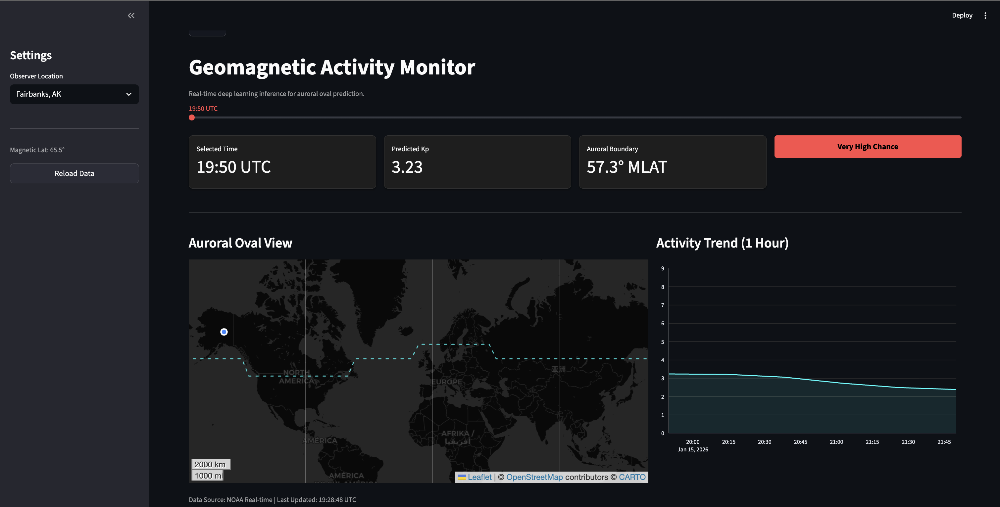

#### [AuroraNet](https://github.com/shaandpatel/AuroraNet)
Predicting the likelihood of **aurora sightings** using machine learning on geomagnetic and solar data.

#### [DefCoordML](https://github.com/shaandpatel/DefCoordML)
**AI-powered NFL Defensive Coordinator**, designed to anticipate whether the offense will **pass** or **rush** before the snap.
